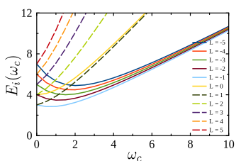
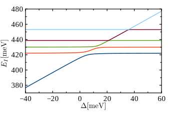

<!-- default syle configuration -->

@title[Introducción]
## Puntos cuánticos
###  Descripción desde la teoría de sistemas finitos II 

  
<small> Andrés Felipe Urquijo </small>
<t></t>
<small> **Director**: Herbert Vinck Posada</small>
<t></t>
<small>Mayo 13 de 2017</small>
Note: Hola

---
@snap[north-west]
### Contenidos
@snapend

@snap[midpoint-west]
@ul[squares]
- Introducción
- Electrones confinados en potencial de oscilador armónico y en un campo magnético externo.
- Modelo hamiltoniano del punto cuántico.
- Polaritones excitónicos en el punto cuántico.
@ulend
@snapend

---
@snap[north-west]
#### Introducción
@snapend

@snap[south-west]
@ol
- Aproximación de masa efectiva
(alrededor del punto $\Gamma$)
`\[ \frac{1}{m_{\mathrm{eff}}} =  \frac{1}{m_0} \left( 1 \pm \frac{2 \mathbf{p}^2}{m_0 E_g} \right) \]`
- Aproximación de bandas parabólicas, aproximación de dos bandas
- Aproximación de función envolvente.
`$\phi(\mathbf{r}) = \xi_{\lambda,m}(\mathbf{r})u_\lambda(\mathbf{r})$`
@olend

Las funciones de onda de confinamiento cumplen: 

`\[\left[ -\frac{\hbar^2 }{2 m_\lambda} \nabla^2 + U_{\mathrm{conf}}(\mathbf{r}) \right] \xi_{\lambda,n}(\mathbf{r}) = \epsilon^{\lambda,n}\xi_{\lambda,n}(\mathbf{r})\]`
@snapend

---
@snap[north-west]
#### N-electrones
@snapend

@snap[west span-100]
Hamiltoniano para una partícula cargada en un campo magnético en la dirección z y un potencial de confinamiento parabólico:
<b></b>

`\[ \mathcal{H} = \frac{1}{2 m_0} \left( \mathbf{p} - \frac{e}{c} \mathbf{A}(\mathbf{r})\right)^2 + e \phi(\mathbf{r}) + \frac{1}{2}m \omega_0^2 \mathbf{r}^2 \]`

En el gauge simétrico

`\[\mathbf{A}(\mathbf{r}) = \frac{1}{2} \mathbf{B} \times \mathbf{r} \qquad \mathbf{B} = B \mathbf{k}\]`

`\[\mathcal{H} =  \frac{\mathbf{p}^2}{2 m} + \frac{1}{2}m\left( \omega_0^2 + \frac{1}{4} \omega_c^2 \right) \mathbf{r}^2 - \frac{1}{2}\omega_c l_z + e \phi(\mathbf{r})\]`
@snapend

---

#### N-electrones

Donde:

- `$\omega_0$` frecuencia del potencial armónico.
- `$\omega_c$` frecuencia de ciclotrón.

<b>Hamiltoniano para N-electrones</b>

`\[ \hat{H} =  \sum_i^N \left[ \frac{\mathbf{p}_i^2}{2 m} + \frac{1}{2}m\left( \omega_0^2 + \frac{1}{4} \omega_c^2 \right) \mathbf{r}_i^2 - \frac{1}{2}\omega_c l_z \right] +\frac{e^2}{\epsilon} \sum_{i < j}^N \frac{1}{|\mathbf{r}_i-\mathbf{r}_j|} \]`

Forma adimensional:

`\[\hat{H} =  \frac{\hbar\omega_c}{2}\sum_i^N \left[ \frac{\mathbf{p}_i^2}{2} + \frac{\mathbf{r}_i^2}{2} + \frac{\omega_o^2}{\omega_c^2} \mathbf{r}_i^2 + l_{z_i}\right] + \frac{e^2}{\epsilon l_B} \sum_{i < j}^N \frac{1}{|\mathbf{r}_i-\mathbf{r}_j|}\]`

---

#### Segunda cuantización

 Donde: 

`\[\mathbf{r} = l_B \mathbf{r}' \qquad \mathbf{p} = \frac{\hbar}{l_B} \mathbf{p}'\]`

 Base de estados de Fock-Darwin 

`\[\hat{\Psi} = \sum_{i,\nu=e.h} \varphi_i(\mathbf{r}) \hat{a}_{i\nu} \qquad [\hat{a}_i, \hat{a}^\dagger_j ]_+ = \delta_{i,j}\]`

`\[\varphi_i(\mathbf{r}) = C_{n_i,|l|_i} r^{|l|_i} e^{-r^2/2} L_{n_i}^{|l|_i}(r^2) e^{i l_i \theta }\]`

`\[\hat{H} = \sum_{i} \frac{\hbar \omega_c}{2} \epsilon_i^{\mathrm{FD}} \hat{e}^\dagger_i\hat{e}_i + \frac{\beta(B)}{2} \sum_{ijkl} V_{ijkl} \hat{e}_i^\dagger \hat{e}_j^\dagger \hat{e}_l \hat{e}_k\]`

---
#### Segunda cuantización
- Base de estados (determinante de slater)

`$| \Psi \rangle  = | n_{e_1}, n_{e_2}, \cdots, n_{e_k} \rangle$`

- Estados de N electrones

`$[ \hat{H}, \hat{L} ] = 0$`
`$|i,j, \cdots \rangle \quad | \quad \sum_i l_i = L$`

---
#### Espectro de energía de 2 electrones

<small>
<b>Figura</b>: Espectro de energía de un sistema de dos electrones sin incluir la interacción de Coulomb. Base de unipartícula compuesta por 36 estados de Fock-Darwin.
</small>

---
#### Espectro de energía de 2 electrones

<small>
<b>Figura</b>: Espectro de energía de un sistema de dos electrones incluyendo la interacción de Coulomb. Base de unipartícula compuesta por 36 estados de Fock-Darwin.
</small>

---
#### Espectro de energía de 1 electrón

<small>
<b>Figura</b>: Espectro de energía de un sistema compuesto por 1 electrón. Base de unipartícula compuesta por 36 estados de Fock-Darwin.
</small>

---
#### Modelo del excitón en el punto cuántico

 Hamiltoniano del punto cuántico (cero campo magnético) 

`\[\hat{H} = \sum_i \frac{1}{2m_e}\left( \mathbf{p}_{e_i} + \frac{e}{c}\mathbf{A}_{e_i} \right)^2 + \frac{1}{2}m_e \omega_0^2 \mathbf{r}_{e_i}^2 + \sum_j \frac{1}{2m_e}\left( \mathbf{p}_{h_j} - \frac{e}{c}\mathbf{A}_{h_j} \right)^2\]`

`\[+ \frac{1}{2}m_h \omega_0^2 \mathbf{r}_{h_j}^2 + \frac{e^2}{\epsilon}\left( \sum_{i < j} \frac{1}{|\mathbf{r}_{e_i} - \mathbf{r}_{e_j}|} + \sum_{i < j} \frac{1}{|\mathbf{r}_{h_i} - \mathbf{r}_{h_j}|} - \sum_{i < j} \frac{1}{|\mathbf{r}_{e_i} - \mathbf{r}_{h_j}|}  \right)\]`

 En la base de estados de oscilador armónico 

`$E_j^{LL} = \frac{\hbar \omega_0}{2}(2 n_j + |l_j|+1 )$`

---
#### Segunda cuantización
$$\hat{H}_{exc} = \sum_i (\epsilon_i^e \hat{e}^\dagger_i \hat{e}_i + \epsilon_{\overline{i}}^h \hat{h}^\dagger_{\overline{i}} \hat{h}_{\overline{i}}) + \frac{\beta}{2} \sum_{ijkl} V_{ijkl} \hat{e}^\dagger_i \hat{e}^\dagger_j \hat{e}_l \hat{e}_k$$

$$+ \frac{\beta}{2} \sum_{\overline{i}\overline{j}\overline{k} \overline{l}} V_{\overline{i}\overline{j}\overline{k} \overline{l}} \hat{h}^\dagger_{\overline{i}} \hat{h}^\dagger_{\overline{j}} \hat{h}_{\overline{l}} \hat{h}_{\overline{k}} - \beta \sum_{ i\overline{j}k \overline{l}} V_{i \overline{j} k \overline{l}} \hat{e}^\dagger_{i} \hat{h}^\dagger_{\overline{j}} \hat{h}_{\overline{l}} \hat{e}_{k}$$

1. Estados de la forma:

$$| \Psi \rangle = | n_{e_1}, n_{e_2}, \cdots, n_{e_k} \rangle \otimes | n_{h_1}, n_{h_2}, \cdots, n_{h_k} \rangle$$

2. Base electrón-hueco

$$l_e = - l_h$$

---
#### Interacción radiación materia

$$H_I = g\sum_{i} (\hat{a}^\dagger \hat{h}_{\overline{i}} \hat{e}_{i} + a \hat{e}_{i}^\dagger\hat{h}_{i}^\dagger)$$

- @fa[caret_right] Estados de la forma

$$| \Psi \rangle = | n_{e_1}, n_{e_2}, \cdots, n_{e_k} \rangle \otimes | n_{h_1}, n_{h_2}, \cdots, n_{h_k} \rangle \otimes | n \rangle$$

-  @fa[caret_right] El hamiltoniano total conmuta con el operador de momento angular toal del sistema
-  @fa[caret_right] Operador variedad de excitación

$$\hat{N} = \frac{1}{2}\sum_{i}(\hat{e}^\dagger_i \hat{e}_i + \hat{h}^\dagger_i \hat{h}_i ) + \hat{a}^\dagger \hat{a}$$

---
#### Interacción radiación materia
$$[\hat{H}, \hat{N}] = 0$$

H y N poseen una base común de autoestados que diagonalizan H por bloques

$$| \mathrm{Npol}\rangle = \sum | N\mathrm{par}, 0\mathrm{ph}\rangle + \sum | N\mathrm{par}-1, 1\mathrm{ph}\rangle  + \cdots$$

---
#### Resultados

<small>
<b>Figura</b>: Espectro de energía en variedad de excitación Npol = 1,  g = 3.
</small>

---
#### Resultados

<small>
<b>Figura</b>: Espectro de energía en variedad de excitación Npol = 1,  g = 3.
</small>

---
#### Excitón en campo magnético

 En la base de niveles de Landau

$$ \hat{H}_{exc} = \sum_i (\epsilon_i^e \hat{e}^\dagger_i \hat{e}_i + \epsilon_{\overline{i}}^h \hat{h}^\dagger_{\overline{i}} \hat{h}_{\overline{i}}) + \sum_{i,j} \langle i | \mathbf{r}^2 | j \rangle \left( \frac{\omega_0^2}{ \omega_c^e }\hat{e}_i^\dagger \hat{e}_j + \frac{\omega_0^2}{ \omega_c^h }\hat{h}_i^\dagger \hat{h}_j\right)$$

$$+ \frac{\beta(B)}{2} \sum_{ijkl} V_{ijkl} \hat{e}^\dagger_i \hat{e}^\dagger_j \hat{e}_l \hat{e}_k + \frac{\beta(B)}{2} \sum_{\overline{i}\overline{j}\overline{k} \overline{l}} V_{\overline{i}\overline{j}\overline{k} \overline{l}} \hat{h}^\dagger_{\overline{i}} \hat{h}^\dagger_{\overline{j}} \hat{h}_{\overline{l}} \hat{h}_{\overline{k}} $$
$$- \beta(B) \sum_{ i\overline{j}k \overline{l}} V_{i \overline{j} k \overline{l}} \hat{e}^\dagger_{i} \hat{h}^\dagger_{\overline{j}} \hat{h}_{\overline{l}} \hat{e}_{k} $$

---
#### Resultados

<small>
<b>Figura</b>: Espectro de energía de un punto cuántico en variedad de excitación Npol = 1,  B = 3T, g = 1 meV, Eg= 417 meV.
</small>

---
<!-- *template: invert -->
### :books: Bibliografía
- :book: M. Kira, F. Jahnke, W. Hoyerm and S. Koch, "_Quantum theory of spontaneus emission and coherent effects in semiconductor microstructure_", Progress in Quantum Electronics, vol. 23, no. 6, 1999.
- :book: M. Kira and S. Koch, "_Semiconductor Quantum Optics_". Cambridge University Press, 2012.

$~$
$~$
$~$
$~$
# :end:
